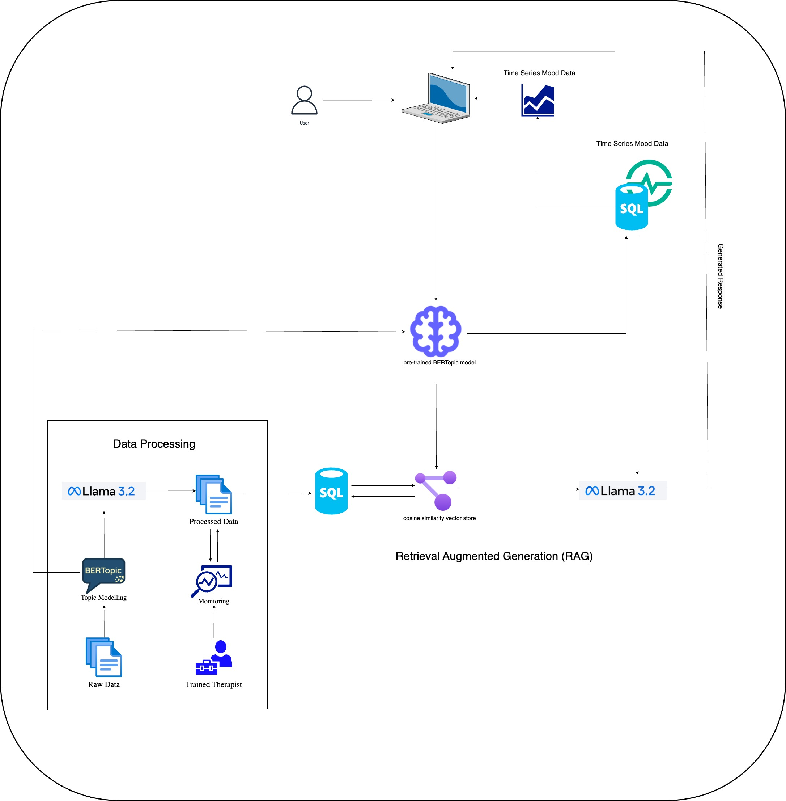

# 🌟 Tranquilo: An AI-Powered Mental Health Journal 🌟

**Tranquilo** is an AI-powered mental health journaling platform developed during the **nwPlus 2025 Hackathon** at the University of British Columbia. The platform offers users:  
- 🧠 **A chatbot-like feature** for mental health support.  
- 📊 **A data analytics dashboard** for deeper insights into their emotional well-being.

---
## Features

- **Interactive Chatbot**: Provides context-aware and therapist-like responses to user prompts. There is a voice input and output option as well!
- **Mood Tracking Dashboard**: Visualizes the user’s mood trends over time for better self-awareness.
- **Personalized Insights**: Uses Retrieval-Augmented Generation (RAG) to generate responses based on the user's prompt and historical data.

---

## 🛠️ Architecture
The backend architecture of Tranquilo leverages modern AI techniques and ML fundamentals, designed with scalability and efficiency in mind:

### 1️⃣ Dataset  
We used the [Mental Health Counseling Conversations](https://huggingface.co/datasets/Amod/mental_health_counseling_conversations) dataset from Hugging Face, which includes over 3,500 rows of patient and therapist conversations.

### 2️⃣ Preprocessing & Topic Modelling  
- **BERTopic** was employed to model the raw dataset, identify themes, and generate human-interpretable topic titles using **Llama3.2**.  
- Topics and associated data were stored in a **SQL database** for efficient querying.

### 3️⃣ Retrieval  
- The trained BERTopic model predicts the topic of a user’s input prompt.  
- Therapist responses matching the topic are retrieved and reranked using **cosine similarity** to determine the **top 3 most relevant responses**.

### 4️⃣ Sentiment & Mood Analysis  
- An **LLM** performs sentiment analysis to evaluate user mood.  
- A brief topic summary of the user’s input is generated and stored in a **time-series SQL database**.

### 5️⃣ Response Generation via RAG  
- The user’s prompt, the top 3 therapist responses, and **5 days of user mood history** are used to build a **Retrieval-Augmented Generation (RAG)** pipeline powered by **Llama3.2**.  
- This pipeline generates a **therapist-like, context-aware response**, integrating current and historical user data.

 

---
## 🎥 Demo

---

## 🏆 Hackathon Highlights
- **Team**: Angus Lau, Parth Patel, Akshat Kalra, and Sai Pusuluri.  
- **Special Challenges**: Successfully deployed the entire architecture locally for the sponsor prize.
- **Key Achievement**: Delivered seamless, meaningful responses through a robust AI pipeline, making mental health support more accessible and personalized.

---

## 💻 Tech Stack
- **Programming Language**: Python  
- **Backend Framework**: Flask  
- **AI Models**: BERTopic, Llama3.2  
- **Database**: SQLite  
- **Deployment**: Local Deployment for Hackathon Presentation using google colab  

---

## 📈 Future Scope
- Cloud deployment for scalable use.
- Enhanced analytics and dashboard features.
- Integration with other softwares such as Notion 
- Integration with Amazon Echo

## Acknowledgements

A huge thank you to my incredible teammates—Angus Lau, Parth Patel, and Akshat Kalra—for their collaboration and expertise. Special recognition to Akshat for his love of Flask and all the fun moments during development!

## License

This project is licensed under the Apache-2.0 License.

## Disclaimer 

Tranquilo is a hackathon project and is not a substitute for professional mental health advice. Always consult with a licensed therapist for any mental health concerns.
